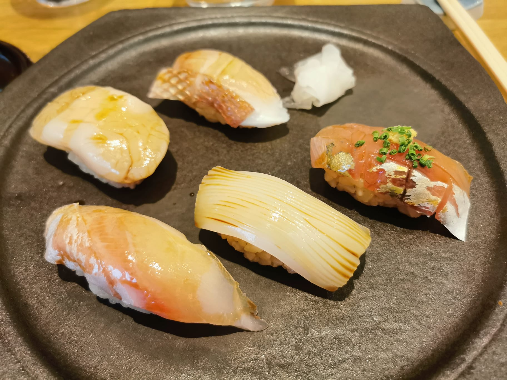
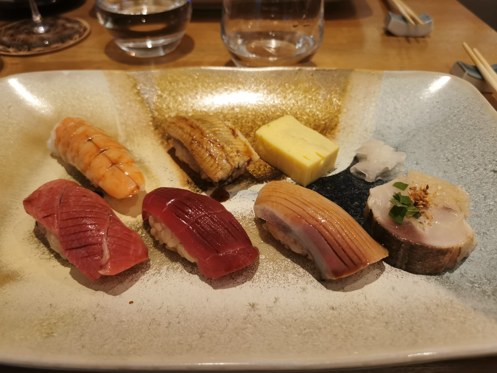

# Yushin - Omakase

## Introduction

Un Omakase désigne un restaurant où le chef choisit l'intégralité des plats qui seront servis.

Cette page décrit l'expérience vécue au [Yushin](https://www.yushin.fr/) à Paris, un restaurant proposant une formule Omakase.
Le chef, Shuhei YAMASHITA, partage également ses connaissances sur la chaîne [Cuisine YAMASHITA style](https://www.youtube.com/channel/UC3JEv2kNJ-ZZc0pgq1e-Beg).

Nous avons pu goûter un menu constitué de 11 sushis, ainsi que 4 plats servis séparément, incluant: 
* Un tartare de langouste au citron.
* Une recette à base de chair de crabe, d'œufs de saumon.
* Du poisson, tempura de légume, et coulis de maïs.
* Un mochi au chocolat.

## Sushis

Voici les sushis qui m'ont été servis : 

De gauche à droite et de haut en bas :
* St-Jacques
* [Pageot](https://fr.wikipedia.org/wiki/Pagellus_erythrinus)
* Dorade
* Encornet
* Chinchard

De gauche à droite et de haut en bas :
* Crevette
* Anguille
* Omelette
* Thon gras
* Thon
* [Sériole](https://fr.wikipedia.org/wiki/S%C3%A9riole_couronn%C3%A9e)
* Maquereau

## Mes Notes

### Riz

Le riz, légèrement brun, est parfaitement cuit, et est servi tiède.
Il n'est pas particulièrement riche en goût. 
Ni le sel, ni le sucre, ni le vinaigre ne m'a semblé être dominant. 
Il s'agit d'abord de goûter le riz. 
Cela signifie sûrement qu'il vaut mieux ne pas trop le vinaigrer lors de la préparation.

Il se tient bien en bloc. 
Il ne m'a pas paru particulièrement fragile, mais il ne faut pas non plus le manipuler longtemps.

### Poissons

Les tranches de poissons présentent des coupes transversales fines. 
Elles sont traditionnellement utilisées pour couper les nervures des poissons comme le thon. 
Mais elles ont été également utilisées pour l'encornet, afin qu'il soit plus agréable à manger.

Le poisson en lui-même ne semblait pas être trop travaillé. 
En particulier, il est difficile de dire s'il était mariné, ou s'il avait subi un traitement comme le kumbujime.
Il était bon, sans être toutefois particulièrement fort en goût.
Par exemple, la différence de saveurs entre la sériole et la dorade ne m'a pas paru claire.

### En résumé

Je retiens les points suivants : 
* Ne pas trop vinaigrer le riz.
* Ne pas trop travailler le riz pour bien ressentir les grains.
* Les poissons n'ont pas besoin d'être fort en goût.